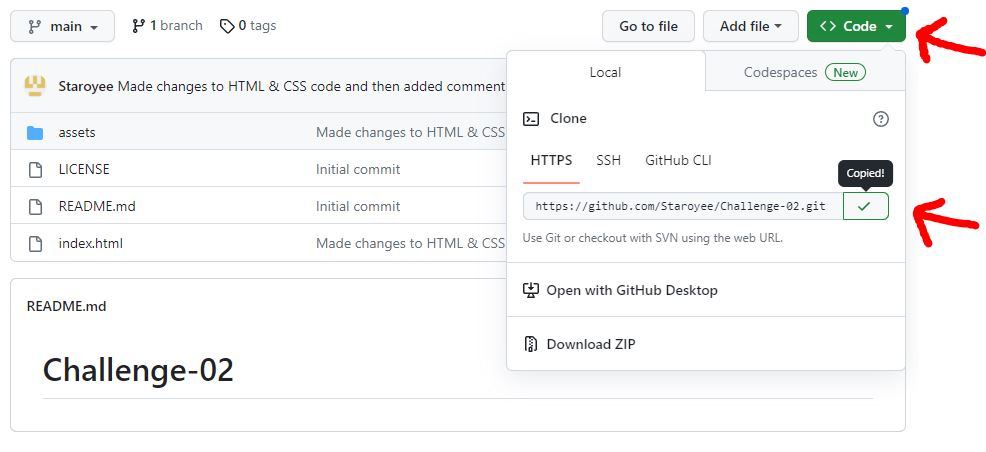

# Challenge-02

## Description
I was tasked to create a codebase that follows accessibility standards
for a site to be optimised for search engines.

* Organised layout of CSS file
* Added Comments to CSS file.

I have added and re-written code to be more optimised such as:

* Changed HTML elements to be semantic and in turn edited the IDs' of the CSS code to include the semantic element changes.
* Added alt attributes to the images to show incase of an image compatability error on the users device.
* Ordered the elements so that they follow a logical structure.
* Added a short concise title within the 'title' element.
* Added code to fix the broken link on the 'search-engine-optimisation' content section, to make sure that when the text on the headers are clicked they take you to the relevent part of the page.
* Added meta tag for "viewport" that allows browsers to control the pages dimentions and scaling.\
* Commited all changes to the github repository with relevent comments

## Solve
The changes to the codebase solve the problem of the site not being accessible or optimized for search engines.

 Comments of changes made have been provided in the accompanying HTML and CSS files.

## I have learned:
* The reason behind using semantic elements vs non semantic elements within HTML
(has greater accessibility, offers a better user experience, and helps with search engine optimisation).
* The basics of de-bugging 

## Installation
Steps to install this project on your local PC
1. Open the termal on your machine.
2. Use the terminal command `cd` to navigate to the directory where we want the repository located.
3. Locate the 'Code' button on the 'Challenge-02' github repository, click it, then copy the 'HTTPS' link to clipboard. (See image)

4. Use the git command `git clone` followed by the URL copied from Github to clone the repo to our machine.
5. The `git clone` command creates a new directory with the same name as the repository. We navigate into our new directory using `cd`.
6. The repository should now be cloned onto your device and able to be edited in VScode or another editing software.

## Instructions

To navigate the site click on one of the three different headings in the header at the top of the page to jump to each individual topic.

## Deployed App Link
https://staroyee.github.io/Code-Refactor-Module-1-Daniel-Masefield/

## Screenshot
The page was too large to fit onto my screen in one screenshot. I have provided two screenshots at 90% zoom to make it show the entire page seamlessly through both screenshots.

## License
MIT License

## Credits / Sources
https://www.w3schools.com/html/html5_semantic_elements.asp
https://www.pluralsight.com/guides/semantic-html
https://web.dev/learn/html/semantic-html/
https://learntheweb.courses/topics/html-semantics-cheat-sheet/
https://www.w3schools.com/css/css_rwd_viewport.asp
https://www.geeksforgeeks.org/physical-and-logical-tags-in-html/
https://www.simplilearn.com/tutorials/html-tutorial/html-semantics#:~:text=The%20semantic%20HTML%20tags%20help,offers%20a%20better%20user%20experience.
https://coding-boot-camp.github.io/full-stack/github/professional-readme-guide
